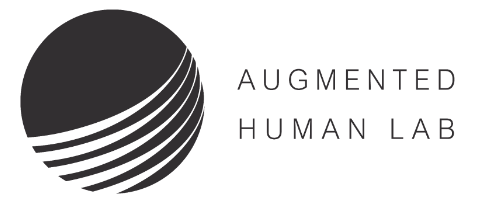
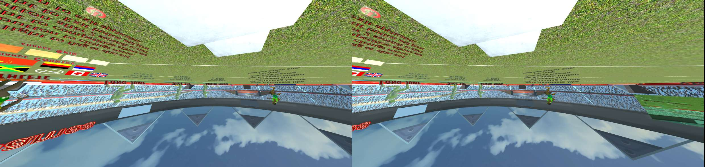
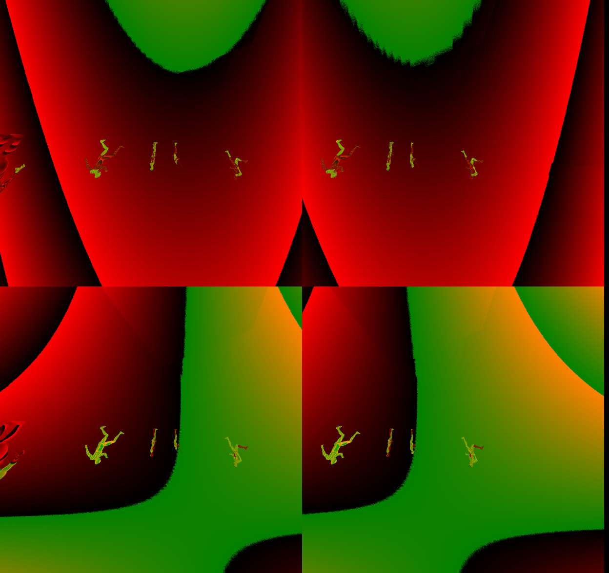
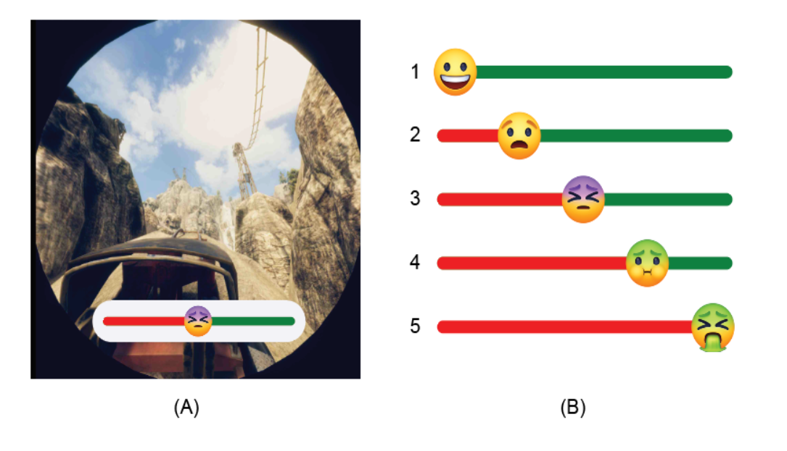

# VRHook


## Introduction

<p style="text-align: justify;">
Despite the increasing popularity of VR games, one factor hindering the industry's rapid growth is motion sickness experienced by the users. Symptoms such as fatigue and nausea severely hamper the user experience.
Machine Learning methods could be used to automatically detect motion sickness in VR experiences, but generating the extensive labeled dataset needed is a challenging task. It needs either very time consuming manual labeling by human experts or modification of proprietary VR application source codes for label capturing. 
To overcome these challenges, we developed a novel data collection tool, VRhook, which can collect data from any VR game without needing access to its source code. This is achieved by dynamic hooking, where we can inject custom code into a game's run-time memory to record each video frame and its associated transformation matrices. Using this, we can automatically extract various useful labels such as rotation, speed, and acceleration. In addition, VRhook can blend a customized screen overlay on top of game contents to collect self-reported comfort scores. In this web page, we provide a real-world VR game dataset gathered using VRHook. 
</p>

## Demo Video
<p align="center">
  <iframe
      width="640"
      height="480"
      src="https://www.youtube.com/embed/p83i0GB2z2Q"
      frameborder="0"
      allow="autoplay; encrypted-media"
  >
  </iframe>
</p>

## Dataset Format

For each game frame, our dataset provides the following types of data. (Download a demo dataset.)

1. RGB Image 


2. Motion Flow Image


3. Depth Image


4. Pose Information for VR Headset and Controllers
```java
class TrackedDevicePose_t
{
	// position in tracker space
	HmdMatrix34_t mDeviceToAbsoluteTracking; 
	// velocity in tracker space in m/s
	HmdVector3_t vVelocity;		
	// angular velocity in radians/s
	HmdVector3_t vAngularVelocity;	
};
```

5. Controller Button/Trackpad Events
```java
class VRControllerState
{
	// bit flags for each of the buttons. 
	uint64_t ulButtonPressed;
	uint64_t ulButtonTouched;
	// Axis data for the controller's analog inputs
	VRControllerAxis_t rAxis[ k_unControllerStateAxisCount ];
};
```

6. Scene Object Data
```java
class ObjectData
{
	// Object Name
    public char[] name;
    // Object Boundary
    public float[6] bounds;
    // Model Matrix
    public float[4][4] localToWorldMatrix; 
}
``` 

7. Camera Data
```java
class CameraData
{
	// Camera Name
    public char[] name;
    // View Matrix
    public float[4][4] view;
    // Projection Matrix
    public float[4][4] projection; 
}
``` 

8. Light Source Data
```java
class LightData
{
	// Light Name
    public char[] name;
    // Light Materials (e.g., shadow & color)
    public float[13] Material;
    // Light Position Matrix
    public float[4][4] localToWorldMatrix; 
}
```

9. User Self Report


## Game List (43 in total):
1. [Athletics.Games.VR](https://store.steampowered.com/app/1029660/Athletics_Games_VR/)
2. [Baby Hands](https://store.steampowered.com/app/708820/Baby_Hands/)
...

## License & Copyright

VRHook does not own the copyright of the games in our datasets. For researchers and educators who wish to use the dataset for non-commercial research and/or educational purposes, we can provide access through our site under the following conditions and terms. 

```
[RESEARCHER_FULLNAME] (the "Researcher") has requested permission to use the VRHook database (the "Database") at The University of Auckland. In exchange for such permission, Researcher hereby agrees to the following terms and conditions:

1. Researcher shall use the Database only for non-commercial research and educational purposes.
2. The University of Auckland holds no representations or warranties regarding the Database, including but not limited to warranties of non-infringement or fitness for a particular purpose.
3. Researcher accepts full responsibility for his or her use of the Database and shall defend and indemnify the VRHook team, The University of Auckland, including their employees, Trustees, officers and agents, against any and all claims arising from Researcher's use of the Database, including but not limited to Researcher's use of any copies of copyrighted images/videos that he or she may create from the Database.
4. Researcher may provide research associates and colleagues with access to the Database provided that they first agree to be bound by these terms and conditions. The University of Auckland reserve the right to terminate Researcher's access to the Database at any time.
5. If Researcher is employed by a for-profit, commercial entity, Researcher's employer shall also be bound by these terms and conditions, and Researcher hereby represents that he or she is fully authorized to enter into this agreement on behalf of such employer.
```

## Request Access To Dataset and Tools

<form action="https://getform.io/f/6d47b2fe-1839-4f5e-a07a-73c68d0d53a1" method="POST" enctype="multipart/form-data">
   
  <label for="name">Your name:</label><br>
  <input type="text" name="name" value="" required> <br>
  <label for="email">Your email:</label><br>
  <input type="text" name="email" value="" required> <br>
  <label for="description">Short research description:</label><br>
  <textarea cols="60" rows="5" type="text" name="description" value="" required></textarea><br><br>
  <label for="name">Please sign the <a href="https://shorturl.at/ADVZ2">form</a> and upload it here:</label>
  <input type="file" accept=".doc,.docx,.pdf" name="file" required><br>
  <input type="hidden" name="_gotcha" style="display:none !important"><br>
  <button type="submit">Submit</button>
</form>

## Citation:
The recommend citation for this software is: 

[```
E. Wen, Nanayakkara, S., Yao, R., and Lim, J. VRhook: A Data Collection Tool for VR Motion Sickness Research. The ACM Symposium on User Interface Software and Technology 2022. 
```](https://dl.acm.org/doi/abs/10.1145/3526113.3545656)

<!-- Google tag (gtag.js) -->
<script async src="https://www.googletagmanager.com/gtag/js?id=UA-82644344-1"></script>
<script>
  window.dataLayer = window.dataLayer || [];
  function gtag(){dataLayer.push(arguments);}
  gtag('js', new Date());

  gtag('config', 'UA-82644344-1');
</script>
