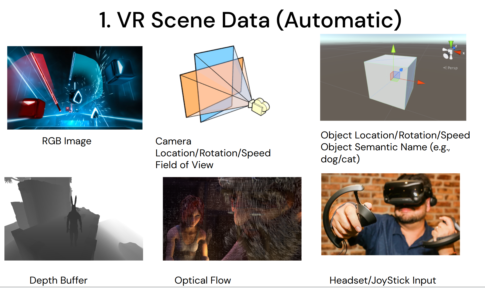
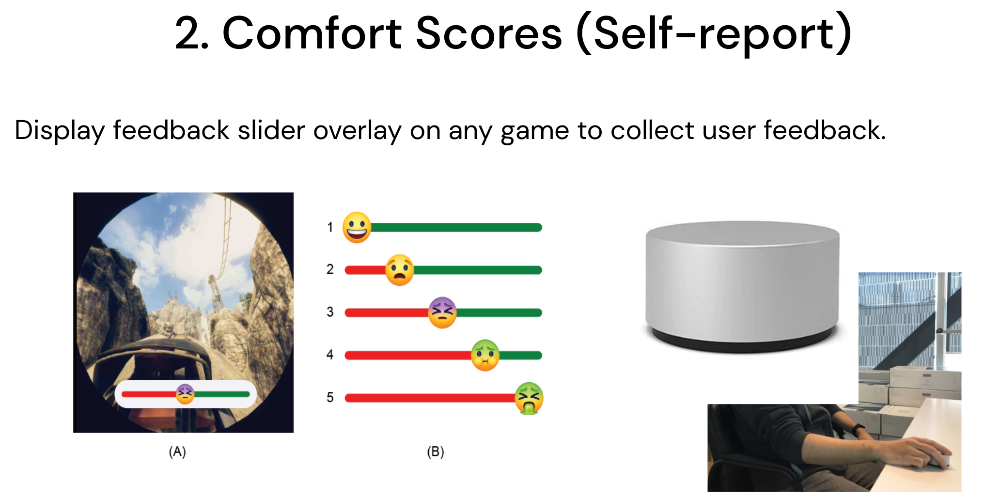

# VRHook

Despite the increasing popularity of VR games, one factor hindering the industry's rapid growth is motion sickness experienced by the users. Symptoms such as fatigue and nausea severely hamper the user experience.
Machine Learning methods could be used to automatically detect motion sickness in VR experiences, but generating the extensive labeled dataset needed is a challenging task. It needs either very time consuming manual labeling by human experts or modification of proprietary VR application source codes for label capturing. 
To overcome these challenges, we developed a novel data collection tool, VRhook, which can collect data from any VR game without needing access to its source code. This is achieved by dynamic hooking, where we can inject custom code into a game's run-time memory to record each video frame and its associated transformation matrices. Using this, we can automatically extract various useful labels such as rotation, speed, and acceleration. In addition, VRhook can blend a customized screen overlay on top of game contents to collect self-reported comfort scores. In this web page, we provide a real-world VR game dataset gathered using VRHook. 

## Acquirng Dataset

Our dataset contains the following two types of data.

To acquire the dataset, please send an email to info@ahlab.org

## Publication
1. E. Wen, Nanayakkara, S., Yao, R., and Lim, J. VRhook: A Data Collection Tool for VR Motion Sickness Research. The ACM Symposium on User Interface Software and Technology 2022.