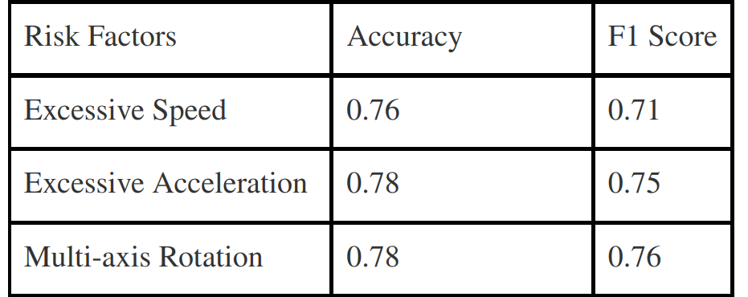

# VRHook


## Introduction

<p style="text-align: justify;">
Despite the increasing popularity of VR games, one factor hindering the industry's rapid growth is motion sickness experienced by the users. Symptoms such as fatigue and nausea severely hamper the user experience.
Machine Learning methods could be used to automatically detect motion sickness in VR experiences, but generating the extensive labeled dataset needed is a challenging task. It needs either very time consuming manual labeling by human experts or modification of proprietary VR application source codes for label capturing. 
To overcome these challenges, we developed a novel data collection tool, VRhook, which can collect data from any VR game without needing access to its source code. This is achieved by dynamic hooking, where we can inject custom code into a game's run-time memory to record each video frame and its associated transformation matrices. Using this, we can automatically extract various useful labels such as rotation, speed, and acceleration. In addition, VRhook can blend a customized screen overlay on top of game contents to collect self-reported comfort scores. In this web page, we provide a real-world VR game dataset named VR.net gathered using VRHook. The current dataset offers approximately 12-hour gameplay videos from ten real-world games in 10 diverse genres. We continuously expand VR.net12
and envision its next version offering 10X more data than the current form.
</p>


## Demo Video
<p align="center">
  <iframe
      width="640"
      height="480"
      src="https://www.youtube.com/embed/p83i0GB2z2Q"
      frameborder="0"
      allow="autoplay; encrypted-media"
  >
  </iframe>
</p>


## Access To Dataset
You can download the current version of VR.net via this [link](/dataset). By downloading this dataset, you agree to our [conditions and terms](/policy). 


## Dataset Format

For each game frame, our dataset provides the following types of data.

1. RGB Image for both eyes (JPG format, Same resolution to your VR Goggle)


2. Motion Flow Image (JPG format. Its resolution has same width to your VR Goggle, but double the height since every motion vector is 2-dimensional).


3. Depth Image from the Main Camera (JPG format. Same resolution to your VR Goggle)


4. Pose Information for VR Headset and Controllers
```java
class TrackedDevicePose
{
	// position in tracker space
	float[4][4]  mDeviceToAbsoluteTracking; 
	// velocity in tracker space in m/s
	float[3]  vVelocity;		
	// angular velocity in radians/s
	float[3] vAngularVelocity;	
};
```

5. Controller Button/Trackpad Events
```java
class VRControllerState
{
	// bit flags for each of the buttons. 
	uint64_t ulButtonPressed;
	uint64_t ulButtonTouched;
	// Axis data for the controller's analog inputs
	VRControllerAxis_t rAxis[ k_unControllerStateAxisCount ];
};
```

6. Scene Object Data
```java
class ObjectData
{
	// Object Name
    public char[] name;
    // Object Boundary
    public float[6] bounds;
    // Model Matrix
    public float[4][4] localToWorldMatrix; 
}
``` 

7. Camera Data
```java
class CameraData
{
	// Camera Name
    public char[] name;
    // View Matrix
    public float[4][4] view;
    // Projection Matrix
    public float[4][4] projection; 
}
``` 

8. Light Source Data
```java
class LightData
{
	// Light Name
    public char[] name;
    // Light Materials (e.g., shadow & color)
    public float[13] Material;
    // Light Position Matrix
    public float[4][4] localToWorldMatrix; 
}
```

9. User Self Report From Microsoft Dial or Voice Commands.


For more detailed information, please refer to our [Data Card](/report).


## Utility of This Dataset 
We extract a demo dataset from our full dataset. The input for our demo dataset is one-second videos, while the output label is three binary numbers, indicating whether the camera is fast moving, whether the camera is accelerating/decelerating excessively, and whether the camera is doing multi-axes rotation. Using this dataset, we fine-tuned a slow-fast deep learning network and achieved the following performance. You can download this pre-processed training dataset [here](https://drive.google.com/drive/u/1/folders/1E_nK_V5X7niBN9k7ujqfMAshpNcY0ZyF). 




## Citation:
The recommend citation for this system is 
```
Wen, E., Kaluarachchi, T. I., Siriwardhana, S., Tang, V., Billinghurst, M., Lindeman, R. W., ... & Nanayakkara, S. (2022, October). VRhook: A Data Collection Tool for VR Motion Sickness Research. In Proceedings of the 35th Annual ACM Symposium on User Interface Software and Technology (pp. 1-9) DOI: https://dl.acm.org/doi/abs/10.1145/3526113.3545656.
```


```bibtex
@inproceedings{wen2022vrhook,
  title={VRhook: A Data Collection Tool for VR Motion Sickness Research},
  author={Wen, Elliott and Kaluarachchi, Tharindu Indrajith and Siriwardhana, Shamane and Tang, Vanessa and Billinghurst, Mark and Lindeman, Robert W and Yao, Richard and Lin, James and Nanayakkara, Suranga},
  booktitle={Proceedings of the 35th Annual ACM Symposium on User Interface Software and Technology},
  pages={1--9},
  year={2022}
}
```

<!-- Google tag (gtag.js) -->
<script async src="https://www.googletagmanager.com/gtag/js?id=UA-82644344-1"></script>
<script>
  window.dataLayer = window.dataLayer || [];
  function gtag(){dataLayer.push(arguments);}
  gtag('js', new Date());

  gtag('config', 'UA-82644344-1');
</script>
